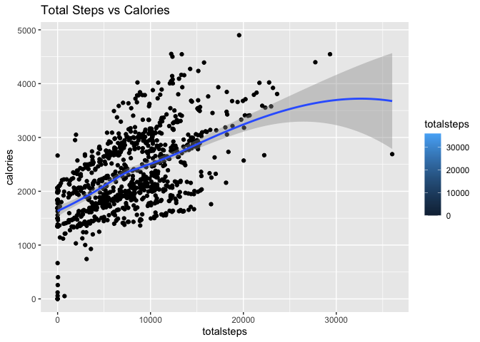
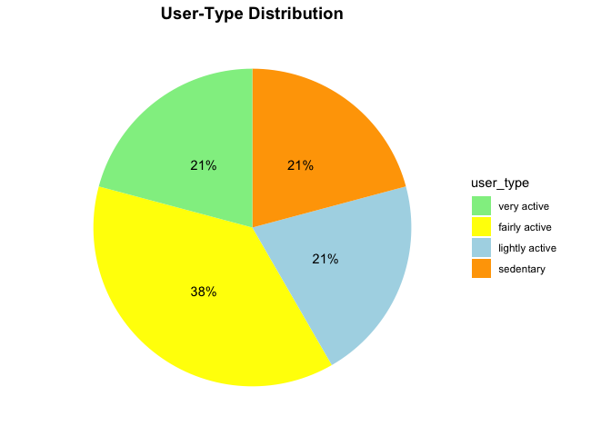

Bellabeat Case Study
================
Jalen Canty

- <a href="#introduction" id="toc-introduction">Introduction</a>
- <a href="#business-objective" id="toc-business-objective">Business
  Objective</a>
- <a href="#analysis" id="toc-analysis">Analysis</a>
- <a href="#conclusion" id="toc-conclusion">Conclusion</a>
- <a href="#recommendation" id="toc-recommendation">Recommendation</a>

## Introduction

Urška Sršen and Sando Mur founded Bellabeat, a high-tech company that
manufactures health-focused smart products. Sršen used her background as
an artist to develop beautifully designed technology that informs and
inspires women around the world. Collecting data on activity, sleep,
stress, and reproductive health has allowed Bellabeat to empower women
with knowledge about their own health and habits. Since it was founded
in 2013, Bellabeat has grown rapidly and quickly positioned itself as a
tech-driven wellness company for women.

## Business Objective

Analyze smart device usage data in order to gain insight into how
consumers use non-Bellabeat smart-devices. Then, using this information,
provide high-level recommendations for how these trends can guide the
Bellabeat marketing strategy.

## Analysis

We’ll be using RStudio as our tool for analysis and data from [**FitBit
Fitness Tracker Data**](https://www.kaggle.com/datasets/arashnic/fitbit)
(CC0: Public Domain, dataset made available through
[Mobius](https://www.kaggle.com/arashnic)) This Kaggle data set contains
personal fitness tracker from thirty Fitbit users. Thirty eligible
Fitbit users consented to the submission of personal tracker data,
including minute-level output for physical activity, heart rate, and
sleep monitoring. It includes information about daily activity, steps,
and heart rate that can be used to explore users’ habits.

**Packages used for this project**:

- here
- skimr
- janitor
- dplyr
- lubridate
- tidyr
- ggplot2
- readr

We’ll focus on these data sets:

1.  dailyActivity_merged
2.  dailysteps_merged
3.  sleepday_merged

Let’s load & rename them.

``` r
activity <- read_csv("/Users/jalencanty/Documents/Projects/Coursera_Projects/Fitbit_Data/dailyActivity_merged.csv")
```

    ## Rows: 940 Columns: 15
    ## ── Column specification ────────────────────────────────────────────────────────
    ## Delimiter: ","
    ## chr  (1): ActivityDate
    ## dbl (14): Id, TotalSteps, TotalDistance, TrackerDistance, LoggedActivitiesDi...
    ## 
    ## ℹ Use `spec()` to retrieve the full column specification for this data.
    ## ℹ Specify the column types or set `show_col_types = FALSE` to quiet this message.

``` r
steps <- read_csv("/Users/jalencanty/Documents/Projects/Coursera_Projects/Fitbit_Data/dailysteps_merged.csv")
```

    ## Rows: 940 Columns: 3
    ## ── Column specification ────────────────────────────────────────────────────────
    ## Delimiter: ","
    ## chr (1): ActivityDay
    ## dbl (2): Id, StepTotal
    ## 
    ## ℹ Use `spec()` to retrieve the full column specification for this data.
    ## ℹ Specify the column types or set `show_col_types = FALSE` to quiet this message.

``` r
sleep <- read_csv("/Users/jalencanty/Documents/Projects/Coursera_Projects/Fitbit_Data/sleepDay_merged.csv")
```

    ## Rows: 413 Columns: 5
    ## ── Column specification ────────────────────────────────────────────────────────
    ## Delimiter: ","
    ## chr (1): SleepDay
    ## dbl (4): Id, TotalSleepRecords, TotalMinutesAsleep, TotalTimeInBed
    ## 
    ## ℹ Use `spec()` to retrieve the full column specification for this data.
    ## ℹ Specify the column types or set `show_col_types = FALSE` to quiet this message.

Count of unique IDs to confirm how many individuals are represented in
the data.

``` r
n_unique(activity$Id)
```

    ## [1] 33

``` r
n_unique(sleep$Id)
```

    ## [1] 24

``` r
n_unique(steps$Id)
```

    ## [1] 33

Let’s check for duplicates.

``` r
sum(duplicated(activity))
```

    ## [1] 0

``` r
sum(duplicated(sleep))
```

    ## [1] 3

``` r
sum(duplicated(steps))
```

    ## [1] 0

We’ll need to remove those duplicate from the sleep data before
analysis.

``` r
sleep <- sleep %>%
  distinct() %>%
  drop_na()
```

Let’s clean column names and adjust to lowercase

``` r
activity <- rename_with(activity, tolower)
clean_names(activity)
```

    ## # A tibble: 940 × 15
    ##            id activity…¹ total…² total…³ track…⁴ logge…⁵ verya…⁶ moder…⁷ light…⁸
    ##         <dbl> <chr>        <dbl>   <dbl>   <dbl>   <dbl>   <dbl>   <dbl>   <dbl>
    ##  1 1503960366 4/12/2016    13162    8.5     8.5        0    1.88   0.550    6.06
    ##  2 1503960366 4/13/2016    10735    6.97    6.97       0    1.57   0.690    4.71
    ##  3 1503960366 4/14/2016    10460    6.74    6.74       0    2.44   0.400    3.91
    ##  4 1503960366 4/15/2016     9762    6.28    6.28       0    2.14   1.26     2.83
    ##  5 1503960366 4/16/2016    12669    8.16    8.16       0    2.71   0.410    5.04
    ##  6 1503960366 4/17/2016     9705    6.48    6.48       0    3.19   0.780    2.51
    ##  7 1503960366 4/18/2016    13019    8.59    8.59       0    3.25   0.640    4.71
    ##  8 1503960366 4/19/2016    15506    9.88    9.88       0    3.53   1.32     5.03
    ##  9 1503960366 4/20/2016    10544    6.68    6.68       0    1.96   0.480    4.24
    ## 10 1503960366 4/21/2016     9819    6.34    6.34       0    1.34   0.350    4.65
    ## # … with 930 more rows, 6 more variables: sedentaryactivedistance <dbl>,
    ## #   veryactiveminutes <dbl>, fairlyactiveminutes <dbl>,
    ## #   lightlyactiveminutes <dbl>, sedentaryminutes <dbl>, calories <dbl>, and
    ## #   abbreviated variable names ¹​activitydate, ²​totalsteps, ³​totaldistance,
    ## #   ⁴​trackerdistance, ⁵​loggedactivitiesdistance, ⁶​veryactivedistance,
    ## #   ⁷​moderatelyactivedistance, ⁸​lightactivedistance

``` r
sleep <- rename_with(sleep, tolower)
clean_names(sleep)
```

    ## # A tibble: 410 × 5
    ##            id sleepday              totalsleeprecords totalminutesasleep total…¹
    ##         <dbl> <chr>                             <dbl>              <dbl>   <dbl>
    ##  1 1503960366 4/12/2016 12:00:00 AM                 1                327     346
    ##  2 1503960366 4/13/2016 12:00:00 AM                 2                384     407
    ##  3 1503960366 4/15/2016 12:00:00 AM                 1                412     442
    ##  4 1503960366 4/16/2016 12:00:00 AM                 2                340     367
    ##  5 1503960366 4/17/2016 12:00:00 AM                 1                700     712
    ##  6 1503960366 4/19/2016 12:00:00 AM                 1                304     320
    ##  7 1503960366 4/20/2016 12:00:00 AM                 1                360     377
    ##  8 1503960366 4/21/2016 12:00:00 AM                 1                325     364
    ##  9 1503960366 4/23/2016 12:00:00 AM                 1                361     384
    ## 10 1503960366 4/24/2016 12:00:00 AM                 1                430     449
    ## # … with 400 more rows, and abbreviated variable name ¹​totaltimeinbed

``` r
steps <- rename_with(steps, tolower)
clean_names(steps)
```

    ## # A tibble: 940 × 3
    ##            id activityday steptotal
    ##         <dbl> <chr>           <dbl>
    ##  1 1503960366 4/12/2016       13162
    ##  2 1503960366 4/13/2016       10735
    ##  3 1503960366 4/14/2016       10460
    ##  4 1503960366 4/15/2016        9762
    ##  5 1503960366 4/16/2016       12669
    ##  6 1503960366 4/17/2016        9705
    ##  7 1503960366 4/18/2016       13019
    ##  8 1503960366 4/19/2016       15506
    ##  9 1503960366 4/20/2016       10544
    ## 10 1503960366 4/21/2016        9819
    ## # … with 930 more rows

Reformatting data columns

``` r
activity <- activity %>%
  rename(date = activitydate) %>%
  mutate(date = as_date(date, format = "%m/%d/%Y"))

sleep <- sleep %>% 
  rename(date = sleepday) %>% 
  mutate(date = as_date(date, format = "%m/%d/%Y %I:%M:%S %p", tz=Sys.timezone()))

steps <- steps %>%
  rename(date = activityday) %>%
  mutate(date = as_date(date, format = "%m/%d/%Y"))
```

Merging activity and sleep data frames by Id & Date to create a new data
frame named activity_sleep.

``` r
activity_sleep <- merge(activity, sleep, by=c("id", "date"))
glimpse(activity_sleep)
```

    ## Rows: 410
    ## Columns: 18
    ## $ id                       <dbl> 1503960366, 1503960366, 1503960366, 150396036…
    ## $ date                     <date> 2016-04-12, 2016-04-13, 2016-04-15, 2016-04-…
    ## $ totalsteps               <dbl> 13162, 10735, 9762, 12669, 9705, 15506, 10544…
    ## $ totaldistance            <dbl> 8.50, 6.97, 6.28, 8.16, 6.48, 9.88, 6.68, 6.3…
    ## $ trackerdistance          <dbl> 8.50, 6.97, 6.28, 8.16, 6.48, 9.88, 6.68, 6.3…
    ## $ loggedactivitiesdistance <dbl> 0, 0, 0, 0, 0, 0, 0, 0, 0, 0, 0, 0, 0, 0, 0, …
    ## $ veryactivedistance       <dbl> 1.88, 1.57, 2.14, 2.71, 3.19, 3.53, 1.96, 1.3…
    ## $ moderatelyactivedistance <dbl> 0.55, 0.69, 1.26, 0.41, 0.78, 1.32, 0.48, 0.3…
    ## $ lightactivedistance      <dbl> 6.06, 4.71, 2.83, 5.04, 2.51, 5.03, 4.24, 4.6…
    ## $ sedentaryactivedistance  <dbl> 0, 0, 0, 0, 0, 0, 0, 0, 0, 0, 0, 0, 0, 0, 0, …
    ## $ veryactiveminutes        <dbl> 25, 21, 29, 36, 38, 50, 28, 19, 41, 39, 73, 3…
    ## $ fairlyactiveminutes      <dbl> 13, 19, 34, 10, 20, 31, 12, 8, 21, 5, 14, 23,…
    ## $ lightlyactiveminutes     <dbl> 328, 217, 209, 221, 164, 264, 205, 211, 262, …
    ## $ sedentaryminutes         <dbl> 728, 776, 726, 773, 539, 775, 818, 838, 732, …
    ## $ calories                 <dbl> 1985, 1797, 1745, 1863, 1728, 2035, 1786, 177…
    ## $ totalsleeprecords        <dbl> 1, 2, 1, 2, 1, 1, 1, 1, 1, 1, 1, 1, 1, 1, 1, …
    ## $ totalminutesasleep       <dbl> 327, 384, 412, 340, 700, 304, 360, 325, 361, …
    ## $ totaltimeinbed           <dbl> 346, 407, 442, 367, 712, 320, 377, 364, 384, …

Let’s check for a correlation between total steps and calories burned.

``` r
ggplot(data = activity, aes(x=totalsteps, y=calories, fill = totalsteps))+
  geom_point() + geom_smooth() + labs(title = "Total Steps vs Calories")
```

<!-- -->

Here the data suggests a direct correlation between the number of steps
taken and the amount of calories burned.

**Let’s categorize users based on activity levels and find the
distribution.**

Average daily steps, calories, and sleep by user ID

``` r
daily_average <- activity_sleep %>%
  group_by(id) %>%
  summarise (mean_daily_steps = mean(totalsteps), mean_daily_calories = mean(calories), mean_daily_sleep = mean(totalminutesasleep))

head(daily_average)
```

    ## # A tibble: 6 × 4
    ##           id mean_daily_steps mean_daily_calories mean_daily_sleep
    ##        <dbl>            <dbl>               <dbl>            <dbl>
    ## 1 1503960366           12406.               1872.             360.
    ## 2 1644430081            7968.               2978.             294 
    ## 3 1844505072            3477                1676.             652 
    ## 4 1927972279            1490                2316.             417 
    ## 5 2026352035            5619.               1541.             506.
    ## 6 2320127002            5079                1804               61

Let’s create 4 user-types based on average daily steps.

``` r
user_type <- daily_average %>%
  mutate(user_type = case_when(
    mean_daily_steps < 5000 ~ "sedentary",
    mean_daily_steps >= 5000 & mean_daily_steps < 7499 ~ "lightly active", 
    mean_daily_steps >= 7500 & mean_daily_steps < 9999 ~ "fairly active", 
    mean_daily_steps >= 10000 ~ "very active"
  ))
head(user_type)
```

    ## # A tibble: 6 × 5
    ##           id mean_daily_steps mean_daily_calories mean_daily_sleep user_type    
    ##        <dbl>            <dbl>               <dbl>            <dbl> <chr>        
    ## 1 1503960366           12406.               1872.             360. very active  
    ## 2 1644430081            7968.               2978.             294  fairly active
    ## 3 1844505072            3477                1676.             652  sedentary    
    ## 4 1927972279            1490                2316.             417  sedentary    
    ## 5 2026352035            5619.               1541.             506. lightly acti…
    ## 6 2320127002            5079                1804               61  lightly acti…

Converting user-type totals into percentages of the total number of
users

``` r
user_type_percent <- user_type %>%
  group_by(user_type) %>%
  summarise(total = n()) %>%
  mutate(totals = sum(total)) %>%
  group_by(user_type) %>%
  summarise(total_percent = total / totals) %>%
  mutate(labels = scales::percent(total_percent))

user_type_percent$user_type <- factor(user_type_percent$user_type , levels = c("very active", "fairly active", "lightly active", "sedentary"))

head(user_type_percent)
```

    ## # A tibble: 4 × 3
    ##   user_type      total_percent labels
    ##   <fct>                  <dbl> <chr> 
    ## 1 fairly active          0.375 38%   
    ## 2 lightly active         0.208 21%   
    ## 3 sedentary              0.208 21%   
    ## 4 very active            0.208 21%

Creating a pie-chart to show user-type distribution

``` r
user_type_percent %>%
  ggplot(aes(x="",y=total_percent, fill=user_type)) +
  geom_bar(stat = "identity", width = 1)+
  coord_polar("y", start=0)+
  theme_minimal()+
  theme(axis.title.x= element_blank(),
        axis.title.y = element_blank(),
        panel.border = element_blank(), 
        panel.grid = element_blank(), 
        axis.ticks = element_blank(),
        axis.text.x = element_blank(),
        plot.title = element_text(hjust = 0.5, size=14, face = "bold")) +
  scale_fill_manual(values = c("lightgreen","yellow", "lightblue","orange")) +
  geom_text(aes(label = labels),
            position = position_stack(vjust = 0.5))+
  labs(title="User-Type Distribution")
```

<!-- -->

## Conclusion

In the visualization titled **“Total Steps vs Calories”** the data shows
a direct correlation between the amount of steps walked and calories
burned. This will be important for our recommendations. Additionally,
based on the pie-chart titled **“User-Type Distribution”**, the data
tells us that only 21% of users are considered to be “Very active”. This
lets us know the our area of opportunity with the other 79% of people
who could improve their daily step goals.

## Recommendation

Bellabeat should look into creating a program that gives users an
incentive to reach their daily step goal, perhaps a badge or award
within the app. As a result we can assume users will respond by being
more active and as a result, they’ll burn more calories.

***Thank You***
